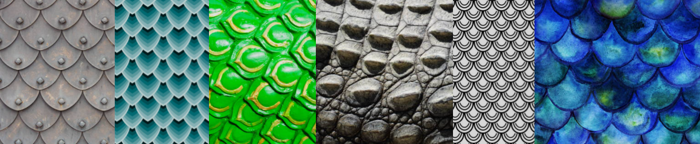

Scales
======
In this project you will create a function that simulates a scale and then use nested loops to make a pattern of scales. The particular type of scale you simulate is up to you. Reptiles, fish, armor, mermaids and dragons are all examples of things with scales. Feathers and hair are evolutionary developments of scales and could be simulated in this project as well.

Program Requirements
--------------------
* Your program will use a function `void scale(int x, int y)` to simulate a *single* scale. The arguments `x` and `y` will be used to position the scale
* Your scale needs a shape that is either **complex** (i.e. uses [`bezier()`](https://processing.org/reference/bezier_.html), [`vertex()`](https://processing.org/reference/vertex_.html), [`curveVertex()`](https://processing.org/reference/curveVertex_.html) or similiar) or **composite** (made from combining multiple simple shapes like `rect()` and `ellipse()`). The shape should not be a simple polygon or ellipse.
* The pattern of scales needs to use nested loops
* If your program uses random numbers, all random numbers must be generated using the `Math.random()` function

Suggested steps to start the assignment
------------------------------------------
1. *Fork* [this repository](https://github.com/APCSLowell/Scales) 
2. Open the `Scales.pde` file. Copy and paste the code into Processing.
3. Complete `void setup()`, `void draw()` and `void scale(int x, int y)`.
5. When you are happy with the program, copy and paste it back into the `Scales.pde` file on GitHub.
5. You will also need to modify `index.html` to customize your website with it's own title, headline and footer. 
6. The final step is to submit the URL for your website to google classroom. 

Extensions
-----------------------
Random variations in size and color are common in nature and will give your pattern a more realistic appearance.

Samples of Student Work
-----------------------
None yet!
